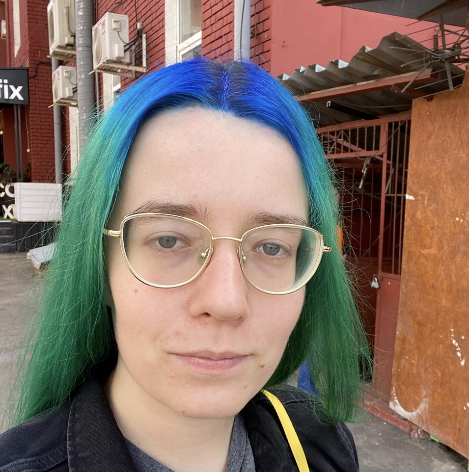
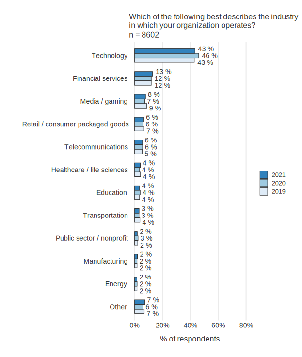
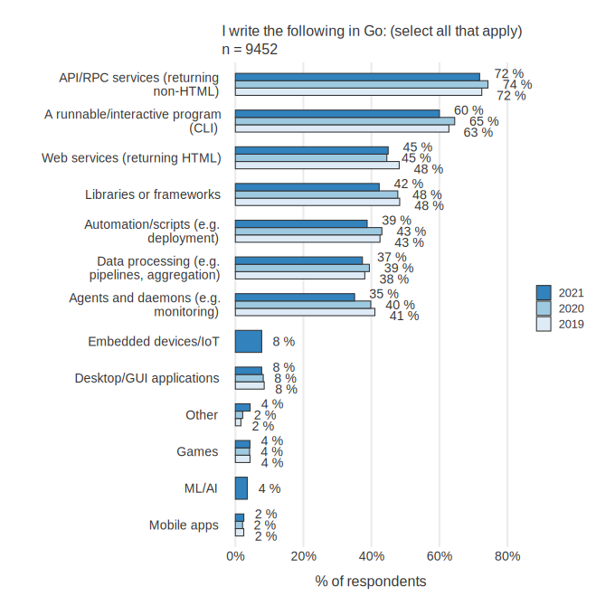

# Почему golang?

---

# Включить Скринкаст

---

# Отметиться на лекции

(мы очень хотим увидеть ваши отзывы о лекциях)

---

# Преподаватели

### Сулаев Антон

###### Тимлид разработки backend'a Почты

### Персиянова Вероника

###### Разработчик команды backend'a Почты

### Федорова Дарья

###### Ведущий разработчик команды backend'а Почты

### Киселев Андрей

###### Разработчик кросс-командных решений для backend'а Почты

---

# Организационное

- Это факультатив. ходить на него - ваше решение
- Можно не делать домашку, если она вам не нравится
- Можно вообще не делать домашки
- Но если вы делаете домашку - вы её делаете сами
- За списывание отчисляем с курса

---

# Где больше всего используется golang

(<https://go.dev/blog/survey2021-results>)

---

# Для чего больше всего используется golang

(<https://go.dev/blog/survey2021-results>)

---

# Кто использует в VK

- Почта
- Реклама
- Юла
- Delivery Club
- Облако
- Медиапроекты
- Процессинг
- vkontakte
- Внутренняя разработка

---

# Кто использует в России

- VK
- 2GIS
- Acronis
- avito.ru
- Gett
- ITooLabs
- Izvestia
- iSpring
- mc² software

- OZON.ru
- Сбермаркет
- Positive Technologies
- PostmanQ - High performance Mail Transfer Agent (MTA)
- ThetaPad
- Tinkoff
- Tochka
- TRY.FIT

---

# Краткая история golang

## Разрабатывался ветеранами индустрии

- Кен Томпсон (UNIX, UTF-8, C)
- Роб Пайк (UTF-8, Plan 9, Inferno)
- Роберт Гризмер (Java HotSpot, Sawzall, распределённые системы Google)

## В условиях большой компании

- Много кода
- Много программистов
- Много серверов (а на них много ядер)
- Есть легаси код

---

# Про сервера и ядра

(<https://github.com/karlrupp/microprocessor-trend-data>)

---
<!-- https://www.quora.com/Scala-vs-Go-Could-people-help-compare-contrast-these-on-relative-merits-demerits -->
# Реалии разработки*

- Меньше кода - проще для понимания. но есть грань.
- Код читается чаще чем пишется
- Код часто живёт дольше, чем мы предполагаем
- Человек, который тестирует или поддерживает код, чаще всего не его первоначальный автор
- Средний уровень разработчика, который читает, пишет, поддерживает или тестирует код - “не эксперт”

---

# Много кода, много программистов, legacy

- Простой и компактный синтаксис
- Мало магии и синтаксического сахара
- Нет даже тернарного оператора
- Ориентация на простоту и читабельность кода
- Жесткий стиль кода и инструмент для авто-форматирования
- Множество синтаксических анализаторов

---

# Много кода, много программистов, legacy

- Быстрая компиляция
  - Веб-апи почты собирается за 2 минуты
  - Микросервисы собираются за 1 минуту
- Тесты из коробки
  - Вместе с покрытием и отчётом
  - Вместе с бенчмарками
- Профилировщик из коробки

---

# Много серверов

- Статический бинарь
  - Нет dependency hell
- Удобная работа с зависимостями
  - Просто кладём их в репозиторий
  - Просто скачиваем их с git
- Кросс-компиляция

---

# Много ядер в процессоре

- Асинхронный i/o на уровне языка (по модели CSP)
  - Нет callback-hell
  - Весь код стандартной библиотеки и внешних либ тоже!

- Приложение масштабируется на все ядра процессора

---

# 10 кубиков программиста

- Бизнесу не нужно самовыражение программиста и его игры в песочнице

<table >
<tr>
    <td bgcolor="#cfe2f3">язык</td>
    <td bgcolor="#cfe2f3">язык</td>
    <td bgcolor="#cfe2f3">язык</td>
    <td bgcolor="#fff2cc">магия</td>
    <td bgcolor="#fff2cc">рантайм</td>
    <td bgcolor="#fff2cc">стиль</td>
    <td bgcolor="#fff2cc">отладка</td>
    <td bgcolor="#d9ead3">задача</td>
    <td bgcolor="#d9ead3">задача</td>
    <td bgcolor="#d9ead3">задача</td>
</tr>
</table>

 

- Бизнесу нужен продукт
- На go скучно заниматься чем-то кроме продукта
  - Потому что там не так прикольно делать всякие классные штуки с новым синтаксисом

<table>
<tr>
    <td bgcolor="#cfe2f3">язык</td>
    <td bgcolor="#cfe2f3">язык</td>
    <td bgcolor="#cfe2f3">язык</td>
    <td bgcolor="#fff2cc">магия</td>
    <td bgcolor="#d9ead3">задача</td>
    <td bgcolor="#d9ead3">задача</td>
    <td bgcolor="#d9ead3">задача</td>
    <td bgcolor="#d9ead3">задача</td>
    <td bgcolor="#d9ead3">задача</td>
    <td bgcolor="#d9ead3">задача</td>
</tr>
</table>
